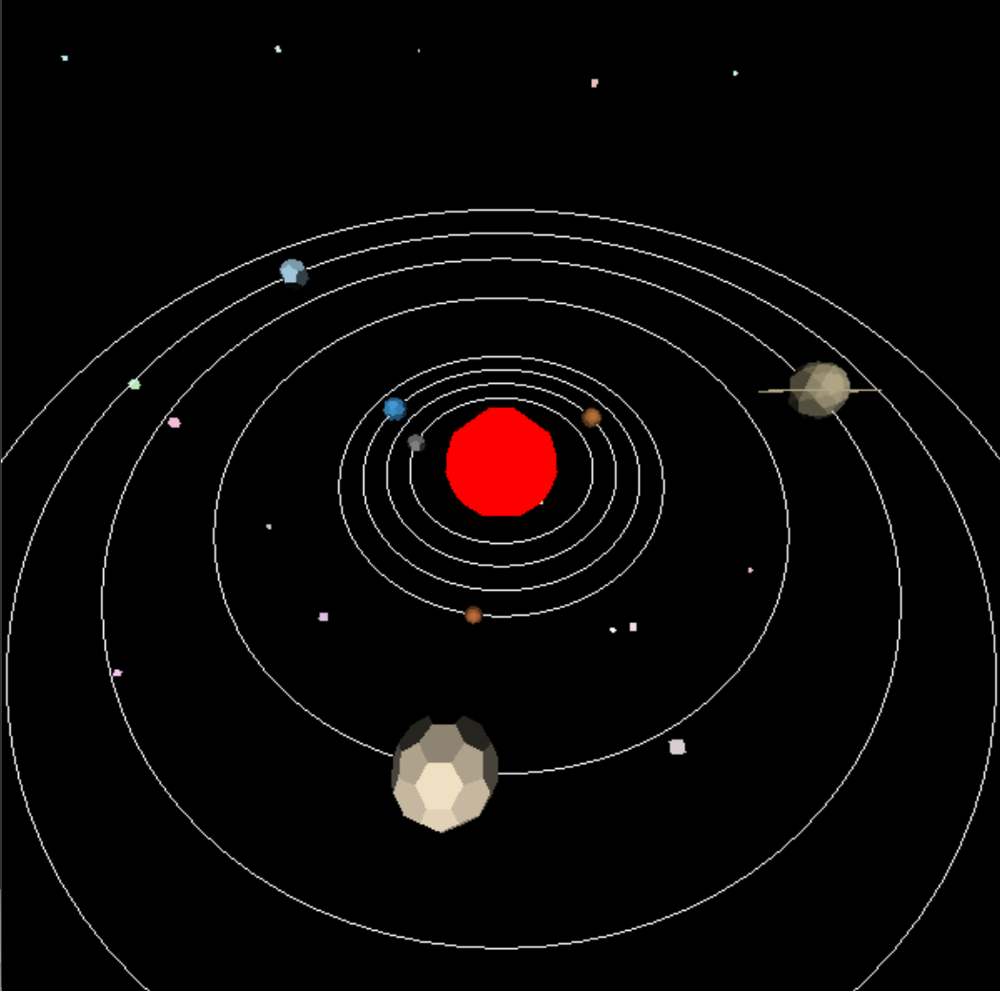

# Solar System

태양계를 직접 만든 그래픽스 엔진으로 렌더링한 OpenGL 데모.

 

## Features

- 직접 구현한 경량 그래픽스 엔진 위에서 동작하는 행성·별 렌더링
- 아핀 변환(Affine) · 투영(Projection) · 클리핑(Clip) 수학을 직접 구현한 파이프라인
- W / S 키 + 마우스로 3D 공간을 자유롭게 이동하는 카메라
- GLSL 버텍스·프래그먼트 셰이더로 처리하는 조명 및 색상
- Snub Dodecahedron 등 다양한 메시로 표현한 행성 형상

## Demo




## Built With

- **C++** — 엔진 전체 로직(카메라, 메시, 렌더러)의 주 구현 언어
- **GLSL** — GPU에서 직접 실행되는 버텍스·프래그먼트 셰이더 작성
- **OpenGL / GLEW** — 크로스플랫폼 그래픽스 API 및 확장 함수 로딩
- **SDL2** — 윈도우 생성, 이벤트 루프, OpenGL 컨텍스트 관리
- **ImGui** — 런타임 디버그 UI 구성
- **stb_image** — 텍스처 이미지 로딩

## Getting Started

### Prerequisites

- Windows
- Visual Studio 2019 이상 (MSVC)
- OpenGL을 지원하는 GPU 드라이버

> SDL2와 GLEW의 DLL 및 라이브러리 파일은 `finalCS200/external/` 아래에 이미 포함되어 있습니다.

### Installation

```bat
# 저장소 클론
git clone https://github.com/Git-Mere/Solar_system.git
cd Solar_system
```

### Build & Run

1. `finalCS200/opengl-dev.sln` 을 Visual Studio에서 열기
2. 솔루션 구성을 **Release** 또는 **Debug** 로 설정
3. `HW` 프로젝트를 시작 프로젝트로 지정 후 **F5** 로 빌드·실행

### Controls

| 키 / 입력 | 동작 |
|-----------|------|
| `W` | 앞으로 이동 |
| `S` | 뒤로 이동 |
| Mouse | 시점 회전 |

## What I Learned

**아핀 변환과 투영 행렬을 라이브러리 없이 직접 구현하기**

OpenGL 튜토리얼 대부분은 glm 같은 수학 라이브러리를 전제로 한다. 이 프로젝트에서는 `Affine.cpp`, `Projection.cpp`, `Clip.cpp`를 직접 작성해야 했다. 행렬 곱셈의 결합 순서를 잘못 적용하면 화면에 아무것도 나오지 않거나 오브젝트가 뒤집혀 보이는 문제가 생겼고, NDC 좌표계와 클립 공간의 차이를 손으로 계산하며 검증하는 과정이 필요했다. 결과적으로 모델→월드→카메라→클립 공간으로 이어지는 변환 파이프라인 전체를 직접 제어할 수 있게 되었다.

**GLVertexArray / GLVertexBuffer 추상화 설계**

드로우콜마다 버퍼를 직접 바인딩하면 상태 충돌이 발생했다. `GLVertexArray`, `GLVertexBuffer`, `GLIndexBuffer` 클래스를 RAII 패턴으로 래핑하고, VAO에 속성 레이아웃을 한 번만 등록하는 구조로 바꾸자 상태 관리 버그가 사라졌다.

**행성 궤도 표현을 위한 계층적 변환**

태양을 기준으로 행성이 공전하고, 행성을 기준으로 위성이 공전하는 구조는 부모 변환 행렬을 자식에게 누적 적용하는 방식으로 해결했다. `planet.cpp`와 `star.cpp`의 분리가 이 계층을 명확하게 유지하는 데 도움이 되었다.

## License

이 저장소에는 별도의 라이선스 파일이 지정되어 있지 않습니다. 외부 라이브러리(SDL2, GLEW, ImGui, stb)는 `finalCS200/external/copyright/` 아래의 각 라이선스를 따릅니다.