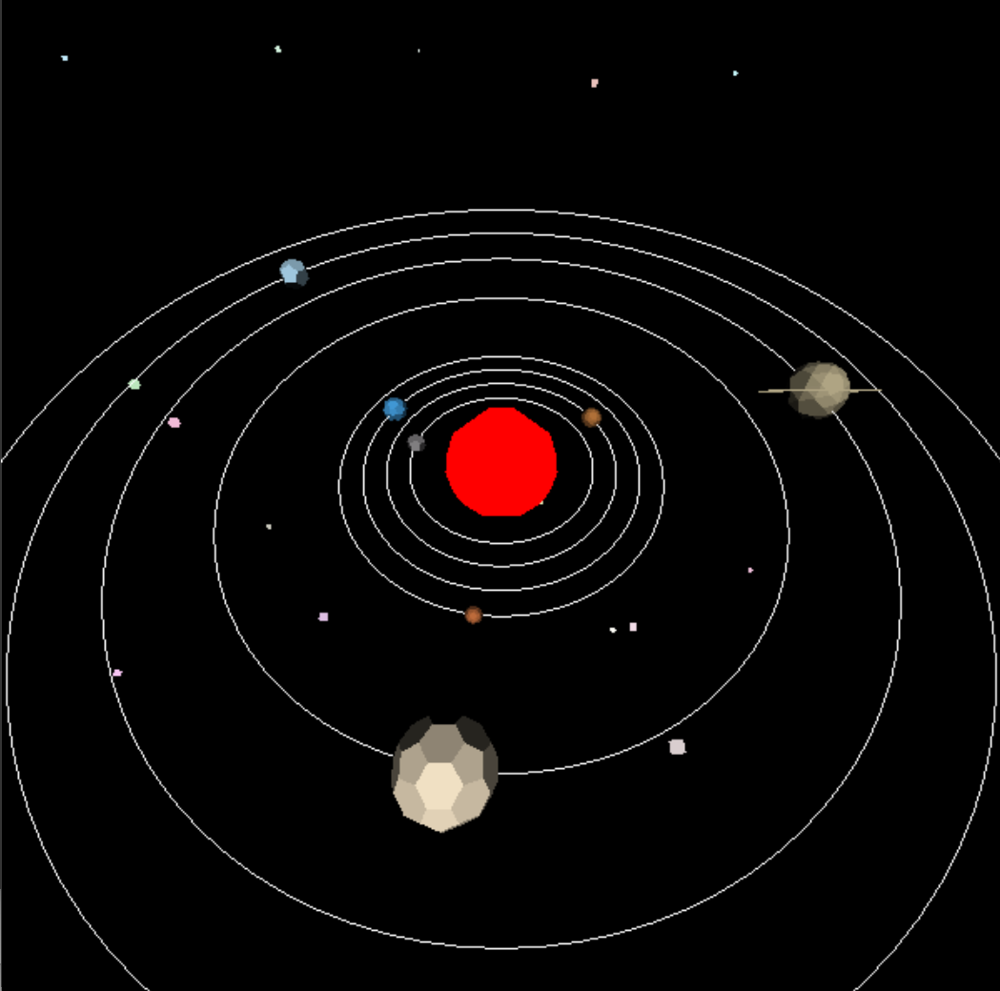

# Solar system

## Look simple solar system
**I created many planets and stars in the solar system using the models I made in my simple graphics engine.**  

---

## Simple control
**Key W, S (You can move forth and back)**  

---

## Play Video

---

## Develope
While learning OpenGL and creating a simple graphics engine, I wanted to create something beautiful with graphics, which led me to make this.  
I made 
